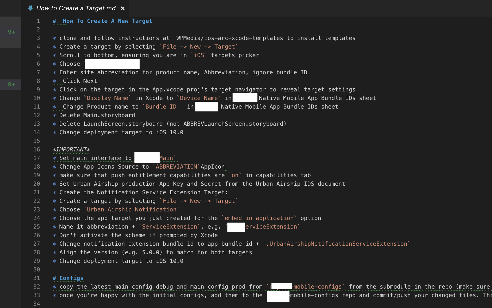
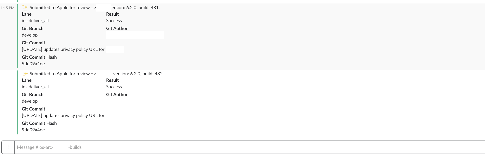
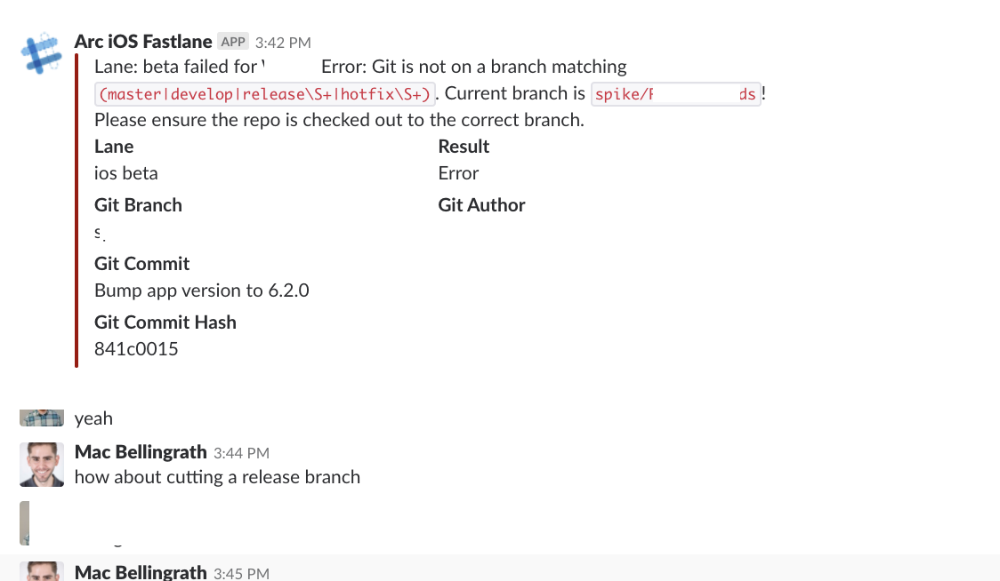
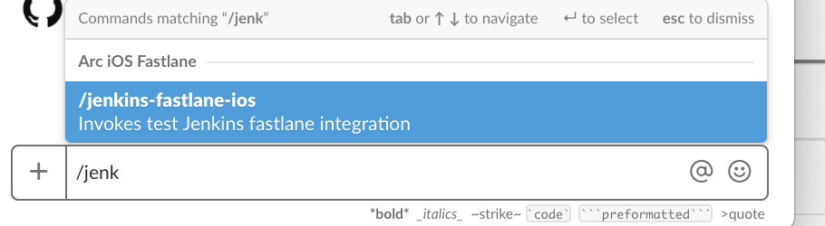
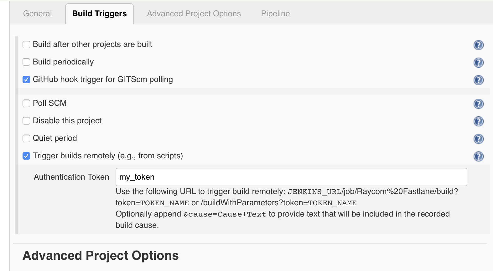

# scripting your workflow with fastlane

### mac bellingrath
### senior developer, the washington post
#### @macbellingrath

---
# context
* Arc Publishing - "Tools for digital publishers built by The Washington Post"
* [iOSDevCampDC 2018 - Scaling iOS Architecture - Arthur Sabintsev](https://www.youtube.com/watch?v=bvXx1mbbGOA&t=2198s)
* One partner, needs 1-3 apps, mulitple months per app
...
* One partner needed 40+ apps, released within days of eachother
* We needed to scale, *fast*

---
## the naive approach, how do we build 40+ apps?
* one at a time
* manual
* error prone (submission errors, invalid configuration)
* repetetive and not fun
* no way we'd make our deadline

---
## [fit] [`Manual Work is a Bug`](https://queue.acm.org/detail.cfm?id=3197520)
### Thomas A. Limoncelli

---
# `Manual Work is a Bug`
a tale of two system administrators:

-  One: "I'm too busy! The person who made the request can't wait! I have 100 other things to do today! Nobody's allocating time for me to write code!"
- Two: Performs manual work when it produces an `artifact`

---
# mindset


`..the successful one had a mindset of always thinking in terms of moving toward the goal of a better automated system.`

---
# [fit] completely manual -> fully autonomous


---
# artifact

What is an `artifact`?
_it furthers the goal of automating your task_

* a bulleted list
* a document
* code snippets
* a guide
* a script

---

# [fit] `..if you can't describe the process in writing, you can't automate it.`

---
## four phases of automation
* document the steps
* create automation equivalents 
* create automation
* create self-service and autonomous systems

---
# phase 1: document the steps



---

# phase 1: document the steps


## `Automation is putting process into code. A bullet list in a process document is code if it is treated that way.`

---
## phase 2: create automation equivalents - `follow the doc`

`Yes, the process is still being done manually, but now each manual iteration is done by setting variables and pasting lines of commands into the terminal window. Each manual iteration tests the accuracy of the snippets and finds new edge cases, bugs, and better ways of verifying the results.`

---
## phase 3: create automation

`Soon these command-line snippets are turned into longer scripts. Like all good code, this is kept in a source code repository. The artifacts begin looking more like real software.`

---

## fastlane

* Created by Felix Krause
* Open source project
* Acquired by Twitter, to become a part of Fabric
* 1 1/2 years at Twitter, acquired by Google as part of Fabric dev tools

* Ruby gem
* Fastlane architecture (actions)
* Plugins 
* Support for custom lanes

--- 
## phase 3: automated-ish


```ruby
 desc 'create a new environment for a new application'
  lane :create_env do
    target_name = UI.input("What is the site abbreviation?").upcase
    bundle_id = UI.input("What is the bundle ID?")
    team_id = UI.input("What is the apple developer portal team ID?")

    list_teams
    itc_team_id = UI.input("What is the iTunes Connect Team ID? hint: run fastlane `list_teams` for a list of itc team ids")
    itc_provider = UI.input("what is your itunes connect provider? Different than itunes team id and developer portal team id. Try lane get_itc_provider")
    env_file = File.new(".env.#{target_name.downcase}", "w")

    text = [
     "APP_ID=#{bundle_id}",
     "FASTLANE_ITC_TEAM_ID=#{itc_team_id}",
     "ITC_PROVIDER=#{itc_provider}",
     "NOTIFICATION_EXTENSION_ID=#{bundle_id}.UrbanAirshipNotificationServiceExtension",
     "TARGET_NAME=#{target_name}",
     "TEAM_ID=#{team_id}"
   ].join("\n")

    env_file.puts(text)
    env_file.close
    UI.success("created environtment for #{target_name}")
  end
```

---
## phase 3: create automation

```ruby
  desc "Verifies Project Build Settings"
  lane :verify_target do |options|
    begin
      check_env
      project = get_project

      # find app target and extension target
      target = get_app_target(project)
      extension_target = get_extension_target(project)

      target = UI.select("Select a target", project.targets) unless target != nil
      extension_target = UI.select("Select extension target", project.targets) unless extension_target != nil

      # verify plist
      plist_path = get_plist_path(target)
      plist = get_plist(plist_path)

      check_plist_for_required_values(plist)

      # verify that target has required capabilities enabled
      capabilities = system_capabilities(project, target)
      check_system_capabilities(capabilities)
      ....
```

---
## phase 3: create automation




---
# what have we automated so far ...
```
[10:52:58]: ----------------------------------------
[10:52:58]: --- Step: Verifying fastlane version ---
[10:52:58]: ----------------------------------------
[10:52:58]: Your fastlane version 2.108.0 matches the minimum requirement of 2.104.0  ✅
[10:52:59]: ------------------------------
[10:52:59]: --- Step: default_platform ---
[10:52:59]: ------------------------------
[10:52:59]: Welcome to fastlane! Here's what your app is setup to do:
+--------+--------------------------+------------------------------------------------------------------------------------------+
|                                                    Available lanes to run                                                    |
+--------+--------------------------+------------------------------------------------------------------------------------------+
| Number | Lane Name                | Description                                                                              |
+--------+--------------------------+------------------------------------------------------------------------------------------+
| 1      | ios test                 | Runs all the tests                                                                       |
| 2      | ios calabash             | Builds a Calabash IPA for the WAFF app target                                            |
| 3      | ios build_all            | Upload a build of every app to TestFlight                                                |
| 4      | ios code_sign_all        | Sync code signing for all applications                                                   |
| 5      | ios qa                   | Check for common errors before submitting to Testflight.                                 |
| 6      | ios version_report       | send a report to slack of the itunes connect status for the current environment version  |
|        |                          | for all apps.                                                                            |
| 7      | ios code_sign            | Runs match                                                                               |
| 8      | ios beta                 | Deploy a build to TestFlight                                                             |
| 9      | ios verify_target        | Verifies Project Build Settings                                                          |
| 10     | ios list_teams           | list all app store connect teams                                                         |
| 11     | ios create_env           | create a new environment for a new application                                           |
| 12     | ios get_itc_provider     | Find ITC provider                                                                        |
| 13     | ios setup_deliver        | set up deliver files for a site                                                          |
| 14     | ios release              | Submits a previously uploaded build for review to Apple                                  |
| 15     | ios deliver_all          | Submits all apps for review                                                              |
| 16     | ios refresh_all_dsyms    | Refresh dSYMs for all sites                                                              |
| 17     | ios submit_release       | creates new release                                                                      |
| 18     | ios update_release_notes | Updates release notes prior to delivery                                                  |
| 19     | ios latest_tf            | get latest build available in itc                                                        |
| 20     | ios refresh_dsyms        | Downloads dSYM files from App Store Connect and uploads them to Crashlytics              |
| 21     | ios screenshots          | Takes Screenshots                                                                        |
| 22     | ios frame                | frame screenshots                                                                        |
| 0      | cancel                   | No selection, exit fastlane!                                                             |
+--------+--------------------------+------------------------------------------------------------------------------------------+
[10:52:59]: Which number would you like run?
```

---
## example
```ruby
desc "Deploy a build to TestFlight"
  lane :beta do |options|
    check_env
    verify_environment
    verify_target
    ensure_git_branch
    ensure_git_status_clean
    verify_xcode_version
    # update App target and Notification extension target version number
    increment_version_number_in_plist
    version_number = get_version_number
    change_log = change_log_since_last_tag
    build_number = increment_build_number
    complete_version_number = version_string(version_number, build_number)
    commit_version_bump
    clean_build_artifacts
    clear_derived_data
    # code sign
    match
    # build app
    gym
    # upload app
    testflight(
      changelog: change_log
    )
    # notify the team that we're done uploading
     slack(
      message: "Submitted build of #{ENV["TARGET_NAME"]} to TestFlight: v#{complete_version_number}. Changelog: #{change_log}",
      success: true
    )
    # upload symbols so that we can symbolicate crashes
    upload_symbols_to_crashlytics
    # create a pre-release tag in git for this distribution
    set_github_release(
      name: "#{ENV["TARGET_NAME"]} - #{complete_version_number}",
      tag_name: tag_name("#{ENV["TARGET_NAME"]}", version_number, build_number),
      commitish: git_branch,
      description: change_log_since_last_tag
    )
    push_to_git_remote
    rocket
  end
```

---
## phase 4: self-service and autonomous systems


---
# Links

[Manual Work is a Bug](https://queue.acm.org/detail.cfm?id=3197520)
[Fastlane](http://github.com/fastlane/fastlane)
[Felix Krause Interview](https://itunes.apple.com/us/podcast/31-code-signing-but-for-apis-with-special-guest-felix-krause/id1267161825?i=1000418745689&mt=2)